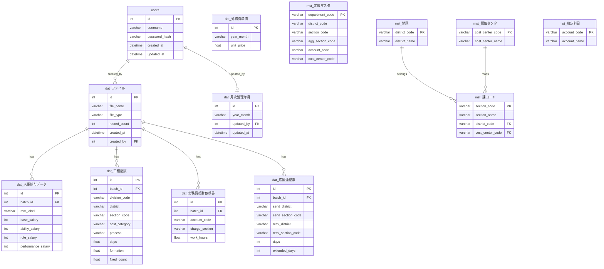
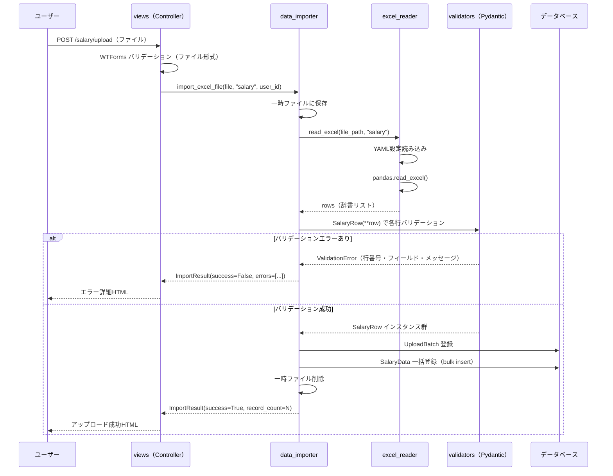
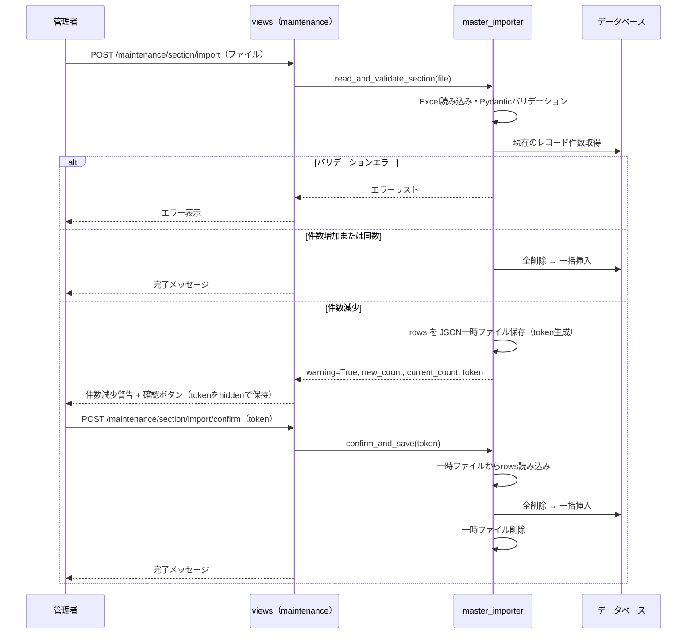
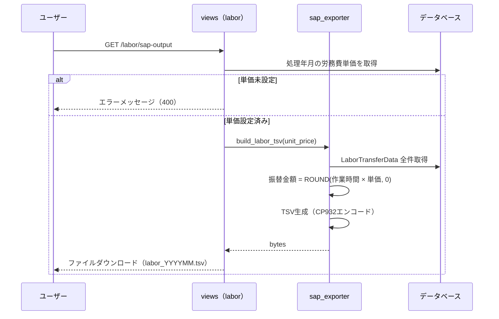

# 内部設計書

**システム名:** エクセルデータ取り込みシステム（給与・配賦・労務費・応援管理）  
**バージョン:** 1.0  
**作成日:** 2026-06-02  
**改訂番号:** 初版

---

## 目次

1. [システムアーキテクチャ](#1-システムアーキテクチャ)
2. [ディレクトリ構成](#2-ディレクトリ構成)
3. [レイヤー設計](#3-レイヤー設計)
4. [データベース設計](#4-データベース設計)
5. [モジュール設計](#5-モジュール設計)
6. [主要処理フロー](#6-主要処理フロー)
7. [バリデーション設計](#7-バリデーション設計)
8. [Excel入出力設計](#8-excel入出力設計)
9. [セキュリティ設計](#9-セキュリティ設計)
10. [設定管理](#10-設定管理)
11. [ログ設計](#11-ログ設計)
12. [テスト設計](#12-テスト設計)

---

## 1. システムアーキテクチャ

### 1.1 技術スタック

| レイヤー | 技術 | バージョン |
|---------|------|-----------|
| Webフレームワーク | Flask | ≥3.1.0 |
| ORM | Flask-SQLAlchemy | ≥3.1.1 |
| DBマイグレーション | Flask-Migrate | ≥4.0 |
| 認証 | Flask-Login | ≥0.6.3 |
| フォーム・CSRF | Flask-WTF | ≥1.3.0 |
| HTMX連携 | Flask-HTMX | ≥0.4.0 |
| データバリデーション | Pydantic | ≥2.0.0 |
| Excelファイル処理 | openpyxl | ≥3.1.5 |
| データ処理 | pandas | ≥3.0.3 |
| SQL Server接続 | pyodbc | ≥5.3.0 |
| 設定ファイル | PyYAML | ≥6.0 |
| 環境変数 | python-dotenv | ≥1.2.2 |
| セキュリティ | Werkzeug | ≥3.1.0 |
| テスト | pytest / pytest-flask | ≥9.0.0 / ≥1.3.0 |
| 開発DB | SQLite 3 | — |
| 本番DB | Microsoft SQL Server | — |
| フロントエンド | Bootstrap 5, HTMX, JavaScript | — |

### 1.2 システム構成概要

```
クライアント（ブラウザ）
    │ HTTP + HTMX（部分更新）
    ▼
Flaskアプリケーション（Python）
    │
    ├── views/      ── ルーティング・レスポンス生成
    ├── api/        ── HTMX向けAPI（部分HTMLレスポンス）
    ├── forms/      ── WTFormsによる入力バリデーション
    ├── view_models/── UIデータ転送オブジェクト
    ├── services/   ── ビジネスロジック
    ├── validators/ ── Pydanticデータバリデーション
    ├── models/     ── SQLAlchemy ORMモデル
    └── utils/      ── 横断的ユーティリティ
    │
    ▼
データベース（SQLite/SQL Server）
```

---

## 2. ディレクトリ構成

```
project_root/
├── app/
│   ├── __init__.py           ── Flaskアプリファクトリ（未使用部分）
│   ├── main.py               ── create_app() / アプリファクトリ
│   ├── extensions.py         ── Flask拡張の初期化（db, login_manager, htmx, csrf）
│   ├── errors.py             ── エラーハンドラー登録（403/404/500）
│   │
│   ├── config/               ── 環境別設定
│   │   ├── base.py           ── BaseConfig（共通設定）
│   │   ├── dev.py            ── DevelopmentConfig（SQLite）
│   │   ├── stg.py            ── StagingConfig
│   │   └── prd.py            ── ProductionConfig（SQL Server）
│   │
│   ├── models/               ── SQLAlchemy ORMモデル
│   │   ├── __init__.py       ── モデルエクスポート
│   │   ├── user.py           ── Userモデル
│   │   ├── upload_batch.py   ── UploadBatchモデル
│   │   ├── salary.py         ── SalaryDataモデル
│   │   ├── allocation.py     ── AllocationDataモデル
│   │   ├── labor_transfer.py ── LaborTransferDataモデル
│   │   ├── labor_unit_price.py── LaborUnitPriceモデル
│   │   ├── ouen.py           ── OuenDataモデル
│   │   ├── processing_month.py── ProcessingMonthモデル
│   │   ├── department.py     ── DepartmentMasterモデル（変換マスタ）
│   │   ├── section.py        ── SectionMasterモデル（課マスタ）
│   │   ├── district.py       ── DistrictMasterモデル
│   │   ├── cost_center.py    ── CostCenterMasterモデル
│   │   └── account.py        ── AccountMasterモデル
│   │
│   ├── views/                ── Flaskルート（View関数）
│   │   ├── __init__.py
│   │   ├── auth.py           ── /login, /logout
│   │   ├── main.py           ── /（トップページ）
│   │   ├── salary.py         ── /salary/*
│   │   ├── allocation.py     ── /allocation/*
│   │   ├── labor.py          ── /labor/*
│   │   ├── ouen.py           ── /ouen/*
│   │   └── maintenance.py    ── /maintenance/*
│   │
│   ├── api/                  ── HTMX向けAPI（部分HTMLレスポンス）
│   │   ├── __init__.py
│   │   ├── salary.py
│   │   ├── allocation.py
│   │   ├── labor.py
│   │   ├── ouen.py
│   │   └── maintenance.py
│   │
│   ├── services/             ── ビジネスロジック
│   │   ├── __init__.py
│   │   ├── data_importer.py  ── Excelデータ取り込みオーケストレーション
│   │   ├── excel_reader.py   ── Excelファイル読み込み
│   │   ├── master_importer.py── マスタExcelインポート（確認フロー付き）
│   │   └── sap_exporter.py   ── SAP出力TSV/Excel生成
│   │
│   ├── validators/           ── Pydanticバリデーションモデル
│   │   ├── __init__.py
│   │   ├── salary.py         ── SalaryRow
│   │   ├── allocation.py     ── AllocationRow
│   │   ├── labor_transfer.py ── LaborTransferRow
│   │   ├── ouen.py           ── OuenRow
│   │   └── master.py         ── DepartmentMasterRow, SectionMasterRow
│   │
│   ├── forms/                ── WTFormsフォームクラス
│   │   ├── __init__.py
│   │   ├── upload.py         ── UploadForm（ファイルアップロード）
│   │   └── auth.py           ── LoginForm
│   │
│   ├── view_models/          ── UI用データクラス（dataclass）
│   │   ├── __init__.py
│   │   ├── salary.py         ── SalaryIndexViewModel
│   │   ├── allocation.py     ── AllocationIndexViewModel
│   │   ├── labor.py          ── LaborIndexViewModel
│   │   └── ouen.py           ── OuenIndexViewModel
│   │
│   ├── templates/            ── Jinja2テンプレート
│   │   ├── base.html
│   │   ├── index.html
│   │   ├── salary.html
│   │   ├── allocation.html
│   │   ├── labor.html
│   │   ├── ouen.html
│   │   ├── maintenance_section.html
│   │   ├── maintenance_department.html
│   │   ├── maintenance_data_output.html
│   │   ├── auth/login.html
│   │   ├── components/macros.html    ── 再利用可能マクロ
│   │   ├── errors/                   ── エラーページ
│   │   └── partials/                 ── HTMX部分テンプレート
│   │
│   ├── static/
│   │   ├── css/custom.css
│   │   └── js/upload.js      ── ドラッグ&ドロップ実装
│   │
│   └── utils/
│       ├── __init__.py
│       └── logger.py         ── ロガー設定
│
├── config/
│   └── excel_formats.yaml    ── Excelフォーマット定義
│
├── tests/                    ── pytestテストスイート
├── scripts/
│   ├── create_admin.py       ── 管理者ユーザー作成
│   ├── seed_masters.py       ── マスタデータ初期投入
│   └── generate_sample_excel.py ── サンプルExcel生成
├── instance/                 ── SQLiteデータベース（開発用）
├── docs/                     ── 設計書類
└── pyproject.toml            ── プロジェクト設定・依存関係
```

---

## 3. レイヤー設計

### 3.1 レイヤー構成と責務

```
┌─────────────────────────────────────────────────────────────────┐
│  Presentation Layer                                              │
│  templates/ (Jinja2 HTML)  ←→  static/ (CSS/JS)                │
├─────────────────────────────────────────────────────────────────┤
│  Controller Layer                                                │
│  views/ (Flask Blueprints)  +  api/ (HTMX API)                  │
│  forms/ (WTForms)  +  view_models/ (dataclasses)                │
├─────────────────────────────────────────────────────────────────┤
│  Service Layer                                                   │
│  services/ (data_importer, excel_reader, master_importer,        │
│             sap_exporter)                                        │
├─────────────────────────────────────────────────────────────────┤
│  Validation Layer                                                │
│  validators/ (Pydantic models)                                   │
├─────────────────────────────────────────────────────────────────┤
│  Data Access Layer                                               │
│  models/ (SQLAlchemy ORM)                                        │
├─────────────────────────────────────────────────────────────────┤
│  Infrastructure Layer                                            │
│  SQLite (dev) / SQL Server (prd)                                 │
└─────────────────────────────────────────────────────────────────┘
```

### 3.2 アプリファクトリパターン

`app/main.py` の `create_app(config_name)` がアプリケーションファクトリとして機能する。

```python
def create_app(config_name: str = "dev") -> Flask:
    app = Flask(__name__)
    # 設定読み込み (dev/stg/prd)
    # 拡張機能初期化 (db, login_manager, htmx, csrf)
    # Blueprintの登録 (views, api)
    # エラーハンドラーの登録
    return app
```

### 3.3 Blueprint構成

| Blueprint | プレフィックス | モジュール |
|-----------|--------------|-----------|
| `auth_bp` | — | `views/auth.py` |
| `main_bp` | — | `views/main.py` |
| `salary_bp` | `/salary` | `views/salary.py` |
| `allocation_bp` | `/allocation` | `views/allocation.py` |
| `labor_bp` | `/labor` | `views/labor.py` |
| `ouen_bp` | `/ouen` | `views/ouen.py` |
| `maintenance_bp` | `/maintenance` | `views/maintenance.py` |

---

## 4. データベース設計

### 4.1 テーブル一覧

| テーブル名（物理） | テーブル名（論理） | 種別 |
|-----------------|----------------|------|
| `users` | ユーザー | システム |
| `dat_ファイル` | アップロードバッチ | トランザクション |
| `dat_人事給与データ` | 給与データ | トランザクション |
| `dat_工程配賦` | 工程配賦データ | トランザクション |
| `dat_労務費振替依頼書` | 労務費振替データ | トランザクション |
| `dat_応援連絡票` | 応援連絡票データ | トランザクション |
| `dat_労務費単価` | 労務費単価 | トランザクション |
| `dat_月次処理年月` | 処理年月 | システム |
| `mst_変換マスタ` | 変換マスタ（部門） | マスタ |
| `mst_課コード` | 課マスタ | マスタ |
| `mst_地区` | 地区マスタ | マスタ |
| `mst_原価センタ` | 原価センタマスタ | マスタ |
| `mst_勘定科目` | 勘定科目マスタ | マスタ |

---

### 4.2 テーブル詳細定義

#### 4.2.1 users（ユーザー）

| 列名 | 型 | 制約 | 説明 |
|------|-----|------|------|
| id | INTEGER | PK, AUTO | ユーザーID |
| username | VARCHAR(150) | UNIQUE, NOT NULL | ユーザー名 |
| password_hash | VARCHAR(256) | NOT NULL | Werkzeugハッシュ化パスワード |
| created_at | DATETIME | DEFAULT NOW | 作成日時 |
| updated_at | DATETIME | DEFAULT NOW, ON UPDATE | 更新日時 |

---

#### 4.2.2 dat_ファイル（UploadBatch）

| 列名 | 型 | 制約 | 説明 |
|------|-----|------|------|
| id | INTEGER | PK, AUTO | バッチID |
| file_name | VARCHAR(256) | NOT NULL | アップロードファイル名 |
| file_type | VARCHAR(50) | NOT NULL | ファイル種別（salary/allocation/labor_transfer/ouen） |
| record_count | INTEGER | NOT NULL | 取り込み行数 |
| created_at | DATETIME | NOT NULL | 登録日時 |
| created_by | INTEGER | FK(users.id) | 登録ユーザーID |

---

#### 4.2.3 dat_人事給与データ（SalaryData）

| 列名 | 型 | 制約 | 説明 |
|------|-----|------|------|
| id | INTEGER | PK, AUTO | レコードID |
| batch_id | INTEGER | FK(dat_ファイル.id) | バッチID |
| row_label | VARCHAR(50) | NOT NULL | 行ラベル（人事所属コード） |
| base_salary | INTEGER | NOT NULL | 本給 |
| ability_salary | INTEGER | NOT NULL | 能力給 |
| role_salary | INTEGER | NOT NULL | 職務役割給 |
| performance_salary | INTEGER | NOT NULL | 役割業績給 |
| remuneration | INTEGER | | 報酬 |
| basic_salary | INTEGER | | 本俸 |
| base_wage | INTEGER | | 基本賃金 |
| domestic_salary | INTEGER | | 国内給与 |
| expat_adjustment | INTEGER | | 駐在員給与調整 |
| family_allowance | INTEGER | | 家族手当 |
| qualification_allowance | INTEGER | | 資格手当 |
| shift_add | INTEGER | | 交替勤務加算給 |
| transfer_work_allowance | INTEGER | | 振替勤務就業手当 |
| overtime_allowance | INTEGER | | 早出残業手当 |
| holiday_allowance | INTEGER | | 休日出勤手当 |
| special_holiday_allowance | INTEGER | | 特定休日出勤手当 |
| shift_allowance | INTEGER | | 交替勤務手当 |
| guard_allowance | INTEGER | | 守衛手当 |
| night_work_allowance | INTEGER | | 深夜業手当 |
| single_post_allowance | INTEGER | | 単身赴任手当 |
| temporary_travel | INTEGER | | 一時帰省旅費 |
| night_call_allowance | INTEGER | | 夜間呼出手当 |
| secondment_hours | INTEGER | | 出向補償時間 |
| other_allowance | INTEGER | | その他手当 |
| prev_month_育介 | INTEGER | | 前月育介金額 |
| public_qualification | INTEGER | | 公的資格手当 |
| wage_deduction | INTEGER | | 賃金控除 |
| absent_accounting | INTEGER | | 職場離脱(会計) |
| headcount_accounting | INTEGER | | 人件費人数(会計) |
| total | INTEGER | | 合計 |

---

#### 4.2.4 dat_工程配賦（AllocationData）

| 列名 | 型 | 制約 | 説明 |
|------|-----|------|------|
| id | INTEGER | PK, AUTO | — |
| batch_id | INTEGER | FK(dat_ファイル.id) | バッチID |
| division_code | VARCHAR(50) | NOT NULL | 事業部コード |
| district | VARCHAR(50) | NOT NULL | 地区コード |
| section_code | VARCHAR(50) | NOT NULL | 課コード |
| cost_category | VARCHAR(50) | NOT NULL | 原価区分 |
| process | VARCHAR(50) | NOT NULL | 工程コード |
| process_name | VARCHAR(100) | | 工程名 |
| days | FLOAT | NOT NULL | 日数 |
| formation | FLOAT | NOT NULL | 編成人数 |
| fixed_count | FLOAT | NOT NULL | 固定人数 |

---

#### 4.2.5 dat_労務費振替依頼書（LaborTransferData）

| 列名 | 型 | 制約 | 説明 |
|------|-----|------|------|
| id | INTEGER | PK, AUTO | — |
| batch_id | INTEGER | FK(dat_ファイル.id) | バッチID |
| account_code | VARCHAR(50) | NOT NULL | 勘定科目コード |
| cost_center | VARCHAR(50) | | 原価センタコード |
| charge_section | VARCHAR(50) | NOT NULL | 担当課コード |
| burden_section | VARCHAR(50) | | 負担課コード |
| construction_name | VARCHAR(200) | | 工事名 |
| work_hours | FLOAT | NOT NULL | 作業時間 |
| wbs | VARCHAR(100) | | WBS番号 |
| asset_agg_no | VARCHAR(100) | | 資産集約番号 |
| order_no | VARCHAR(100) | | 指図番号 |
| remarks | VARCHAR(500) | | 備考 |

---

#### 4.2.6 dat_応援連絡票（OuenData）

| 列名 | 型 | 制約 | 説明 |
|------|-----|------|------|
| id | INTEGER | PK, AUTO | — |
| batch_id | INTEGER | FK(dat_ファイル.id) | バッチID |
| send_district | VARCHAR(50) | NOT NULL | 送り出し地区コード |
| send_section_code | VARCHAR(50) | NOT NULL | 送り出し課コード |
| recv_district | VARCHAR(50) | NOT NULL | 受け入れ地区コード |
| recv_section_code | VARCHAR(50) | NOT NULL | 受け入れ課コード |
| departure_date | DATE | | 出課日 |
| return_date | DATE | | 帰課日 |
| days | INTEGER | NOT NULL | 日数 |
| extended_days | INTEGER | NOT NULL | 延べ日数 |
| remarks | VARCHAR(500) | | 備考 |

---

#### 4.2.7 dat_労務費単価（LaborUnitPrice）

| 列名 | 型 | 制約 | 説明 |
|------|-----|------|------|
| id | INTEGER | PK, AUTO | — |
| year_month | VARCHAR(7) | NOT NULL | 処理年月（YYYY-MM形式） |
| unit_price | FLOAT | NOT NULL | 労務費単価（円/時間） |

---

#### 4.2.8 dat_月次処理年月（ProcessingMonth）

| 列名 | 型 | 制約 | 説明 |
|------|-----|------|------|
| id | INTEGER | PK | 常に1（シングルトン） |
| year_month | VARCHAR(7) | NOT NULL | 処理年月（YYYY-MM形式） |
| updated_by | INTEGER | FK(users.id) | 更新者 |
| updated_at | DATETIME | NOT NULL | 更新日時 |

---

#### 4.2.9 mst_変換マスタ（DepartmentMaster）

| 列名 | 型 | 制約 | 説明 |
|------|-----|------|------|
| department_code | VARCHAR(20) | PK | 部門コード（人事所属コード） |
| district_code | VARCHAR(20) | NOT NULL | 地区コード |
| section_code | VARCHAR(20) | NOT NULL | 課コード |
| agg_section_code | VARCHAR(20) | NOT NULL | 集約課コード |
| account_code | VARCHAR(20) | NOT NULL | 勘定科目コード |
| cost_center_code | VARCHAR(20) | NOT NULL | 原価センタコード |

**計算プロパティ**
- `chiku_ka_code`: `district_code + section_code`
- `chiku_shuuyaku_ka_code`: `district_code + agg_section_code`

---

#### 4.2.10 mst_課コード（SectionMaster）

| 列名 | 型 | 制約 | 説明 |
|------|-----|------|------|
| section_code | VARCHAR(20) | PK | 課コード |
| section_name | VARCHAR(100) | NOT NULL | 課名 |
| district_code | VARCHAR(20) | FK(mst_地区.district_code) | 地区コード |
| cost_center_code | VARCHAR(20) | FK(mst_原価センタ.cost_center_code) | 原価センタコード |

---

#### 4.2.11 mst_地区（DistrictMaster）

| 列名 | 型 | 制約 | 説明 |
|------|-----|------|------|
| district_code | VARCHAR(20) | PK | 地区コード |
| district_name | VARCHAR(100) | NOT NULL | 地区名 |

---

#### 4.2.12 mst_原価センタ（CostCenterMaster）

| 列名 | 型 | 制約 | 説明 |
|------|-----|------|------|
| cost_center_code | VARCHAR(20) | PK | 原価センタコード |
| cost_center_name | VARCHAR(100) | NOT NULL | 原価センタ名 |

---

#### 4.2.13 mst_勘定科目（AccountMaster）

| 列名 | 型 | 制約 | 説明 |
|------|-----|------|------|
| account_code | VARCHAR(20) | PK | 勘定科目コード |
| account_name | VARCHAR(100) | NOT NULL | 勘定科目名 |

---

### 4.3 ER図



---

## 5. モジュール設計

### 5.1 services/data_importer.py

**責務:** Excelファイルのアップロードから DB保存までのオーケストレーション

#### ImportResult（戻り値データクラス）

| フィールド | 型 | 説明 |
|-----------|-----|------|
| success | bool | 全体の成否 |
| batch_id | int \| None | 成功時のバッチID |
| record_count | int | 取り込み行数 |
| errors | list[dict] | エラー詳細リスト（行番号・フィールド・メッセージ） |

#### 主要関数

```
import_excel_file(file_storage, file_type, user_id) -> ImportResult
    ├── 1. ファイルを一時ディレクトリに保存（ユニークファイル名）
    ├── 2. excel_reader.read_excel(file_path, file_type) でデータ読み込み
    ├── 3. _validate_rows(rows, file_type) で行単位バリデーション
    ├── 4. バリデーションエラーがあれば ImportResult(success=False, errors=...) を返す
    ├── 5. UploadBatch レコードを作成
    ├── 6. _build_db_record(row, file_type, batch_id) でORMオブジェクト生成
    ├── 7. db.session.add_all() で一括挿入
    ├── 8. db.session.commit()
    ├── 9. 一時ファイルを削除
    └── 10. ImportResult(success=True, batch_id=..., record_count=...) を返す
```

---

### 5.2 services/excel_reader.py

**責務:** YAMLフォーマット定義に基づくExcelファイルの読み込み

#### 主要関数

```
get_format_config(file_type: str) -> dict
    └── config/excel_formats.yaml を読み込んで対象種別の設定を返す

read_excel(file_path: str, file_type: str) -> list[dict]
    ├── get_format_config でシート名・ヘッダー行・使用列取得
    ├── pandas.read_excel() でデータフレーム読み込み
    ├── 各行を辞書化（列名 → 値）
    └── 行番号をキーとして追加（エラー報告用）
```

---

### 5.3 services/master_importer.py

**責務:** マスタデータのExcelインポート（確認フロー付き）

#### 確認フロー

```
read_and_validate_section(file) -> ValidationResult
    ├── Excelを読み込み、SectionMasterRowでPydanticバリデーション
    ├── PK重複チェック
    ├── 現在のDB件数と比較
    └── ValidationResult { rows, current_count, new_count, warning_flag }

save_pending(rows, token) -> None
    └── instance/uploads/{token}.json に一時保存

load_pending(token) -> list[dict] | None
    └── 一時ファイルを読み込み

confirm_and_save(token) -> None
    ├── load_pending(token) でデータ取得
    ├── 既存テーブルを全削除
    ├── 新しいレコードを一括挿入
    └── delete_pending(token)
```

---

### 5.4 services/sap_exporter.py

**責務:** SAP連携用ファイルの生成

#### 主要関数

```
build_allocation_tsv() -> bytes
    ├── AllocationData を全件取得
    ├── 列マッピングしてTSVを生成
    └── CP932でエンコードして返す

build_labor_tsv(unit_price: float) -> bytes
    ├── LaborTransferData を全件取得
    ├── 振替金額 = ROUND(work_hours × unit_price, 0) で計算
    ├── 列マッピングしてTSVを生成
    └── CP932でエンコードして返す

build_labor_tran_mock_excel(district_code: str) -> bytes
    ├── 対象地区の OuenData を取得
    ├── 労務費振替依頼書フォーマットに変換
    └── openpyxl でExcel生成してバイナリで返す
```

---

### 5.5 validators/（Pydanticモデル）

各バリデーターは `pydantic.BaseModel` を継承し、Excelの1行を1インスタンスとして検証する。

**共通パターン:**
- `model_config = ConfigDict(populate_by_name=True)` で別名フィールドを許容
- `@field_validator` デコレータでカスタム変換（数値のカンマ除去、Excelシリアル日付変換）
- バリデーションエラーは `ValidationError` として行番号とともに収集される

---

### 5.6 view_models/（データクラス）

各ViewModel は `@dataclass` として定義され、View関数からテンプレートにデータを渡す際に使用する。

| ViewModel | フィールド |
|----------|-----------|
| SalaryIndexViewModel | batch (UploadBatch \| None), salary_count (int) |
| AllocationIndexViewModel | batches (Pagination), salary_count (int) |
| LaborIndexViewModel | batches (Pagination), unit_price (LaborUnitPrice \| None) |
| OuenIndexViewModel | batches (Pagination), salary_count (int) |

---

## 6. 主要処理フロー

### 6.1 Excelデータ取り込みフロー



---

### 6.2 マスタインポートフロー（確認あり）



---

### 6.3 SAP出力フロー



---

## 7. バリデーション設計

### 7.1 SalaryRow（validators/salary.py）

| フィールド | 型 | 必須 | バリデーションロジック |
|-----------|-----|------|----------------------|
| row_label | str | ○ | 空文字列不可。Alias: `行ラベル` |
| base_salary | int | ○ | カンマ除去 → int変換。Alias: `合計/(明細1)本給` |
| ability_salary | int | ○ | 同上。Alias: `合計/(明細1)能力給` |
| role_salary | int | ○ | 同上。Alias: `合計/(明細1)職務・役割給` |
| performance_salary | int | ○ | 同上。Alias: `合計/(明細1)役割業績給` |
| （その他金額フィールド） | int | — | None許容。Alias: 各列名 |

**数値変換ロジック（field_validator）**
```python
@field_validator("base_salary", ..., mode="before")
def parse_int(cls, v):
    if isinstance(v, str):
        v = v.replace(",", "").strip()
    return int(v) if v not in (None, "") else 0
```

---

### 7.2 AllocationRow（validators/allocation.py）

| フィールド | 型 | 必須 | バリデーションロジック |
|-----------|-----|------|----------------------|
| division_code | str | ○ | 空文字列不可 |
| district | str | ○ | 空文字列不可 |
| section_code | str | ○ | 空文字列不可 |
| cost_category | str | ○ | 空文字列不可 |
| process | str | ○ | 空文字列不可 |
| days | float | ○ | float変換 |
| process_name | str | — | None許容 |
| formation | float | ○ | float変換 |
| fixed_count | float | ○ | float変換 |

---

### 7.3 LaborTransferRow（validators/labor_transfer.py）

| フィールド | 型 | 必須 | バリデーションロジック |
|-----------|-----|------|----------------------|
| account_code | str | ○ | 空文字列不可 |
| charge_section | str | ○ | 空文字列不可 |
| work_hours | float | ○ | float変換 |
| cost_center | str | — | None許容 |
| burden_section | str | — | None許容 |
| construction_name | str | — | None許容 |
| wbs | str | — | None許容 |
| asset_agg_no | str | — | None許容 |
| order_no | str | — | None許容 |
| remarks | str | — | None許容 |

---

### 7.4 OuenRow（validators/ouen.py）

| フィールド | 型 | 必須 | バリデーションロジック |
|-----------|-----|------|----------------------|
| send_district | str | ○ | 空文字列不可 |
| send_section_code | str | ○ | 空文字列不可 |
| recv_district | str | ○ | 空文字列不可 |
| recv_section_code | str | ○ | 空文字列不可 |
| days | int | ○ | int変換 |
| extended_days | int | ○ | int変換 |
| departure_date | date \| None | — | Excelシリアル値 → date変換 |
| return_date | date \| None | — | 同上 |
| remarks | str | — | None許容 |

**Excelシリアル値変換ロジック**
```python
@field_validator("departure_date", "return_date", mode="before")
def parse_date(cls, v):
    if isinstance(v, (int, float)):
        # Excelのシリアル値（1900-01-01起算）からdateに変換
        return datetime(1899, 12, 30) + timedelta(days=int(v))
    return v
```

---

### 7.5 マスタバリデーター（validators/master.py）

#### SectionMasterRow

| フィールド | 型 | 必須 | 最大文字数 |
|-----------|-----|------|-----------|
| section_code | str | ○ | 20 |
| section_name | str | ○ | 100 |
| district_code | str | ○ | 20 |
| cost_center_code | str | ○ | 20 |

#### DepartmentMasterRow

| フィールド | 型 | 必須 | 最大文字数 |
|-----------|-----|------|-----------|
| department_code | str | ○ | 20 |
| district_code | str | ○ | 20 |
| section_code | str | ○ | 20 |
| agg_section_code | str | ○ | 20 |
| account_code | str | ○ | 20 |
| cost_center_code | str | ○ | 20 |

---

## 8. Excel入出力設計

### 8.1 フォーマット設定管理（config/excel_formats.yaml）

Excelファイルのフォーマット定義は YAML ファイルで一元管理し、コード変更なしでフォーマット変更に対応できる。

```yaml
{file_type}:
  display_name: str    # 画面表示用名称
  sheet_name: str      # 対象シート名
  header_row: int      # ヘッダー行番号（1始まり）
  use_cols: str        # 読み込み列範囲（例: "A:AN"）
  columns:
    - name: str        # 列名（ヘッダーの文字列と一致）
      type: str        # データ型（str/int/float/date）
      required: bool   # 必須フラグ
      description: str # 説明（任意）
```

---

### 8.2 一時ファイル管理

| 項目 | 仕様 |
|------|------|
| 保存先 | OSの一時ディレクトリ（`tempfile.gettempdir()`） |
| ファイル名 | UUID4 + 元の拡張子（例：`3f8a2c1d-....xlsx`） |
| 削除タイミング | import_excel_file() の最終処理ステップで削除（成功・失敗問わず） |
| エラー時の削除 | try/finally で確実に削除 |

---

## 9. セキュリティ設計

### 9.1 認証・認可

| 項目 | 実装 |
|------|------|
| 認証方式 | Flask-Login のセッションベース認証 |
| アクセス制御 | `@login_required` デコレータを全ルートに適用 |
| パスワード保存 | `werkzeug.security.generate_password_hash()` でbcrypt相当のハッシュ化 |
| パスワード検証 | `werkzeug.security.check_password_hash()` |
| セッション管理 | Flaskセッション（サーバーサイド署名Cookie） |
| ログアウト | `flask_login.logout_user()` でセッション破棄 |

### 9.2 CSRF対策

| 項目 | 実装 |
|------|------|
| CSRF保護 | Flask-WTFの `CSRFProtect` を全アプリに適用 |
| トークン | フォームの hidden フィールドに埋め込み |
| 検証 | POST/PUT/DELETE リクエストで自動検証 |

### 9.3 ファイルセキュリティ

| 項目 | 実装 |
|------|------|
| ファイル保存なし | アップロードされたExcelは一時ファイルとして処理後即削除 |
| ファイル形式制限 | WTForms `FileAllowed(['xlsx', 'xls'])` で拡張子検証 |
| ファイル名サニタイズ | Werkzeug `secure_filename()` を使用 |

### 9.4 SQLインジェクション対策

- SQLAlchemy ORM を使用し、生SQLは使用しない
- パラメータバインディングにより SQL インジェクションを防止

### 9.5 マスタインポートのトークン管理

| 項目 | 実装 |
|------|------|
| トークン | UUID4 を生成し、一時ファイル名およびフォームの hidden フィールドに使用 |
| 目的 | 確認フォームのリプレイアタック防止 |
| 有効期限 | 確認処理完了後に一時ファイルを削除（再利用不可） |

---

## 10. 設定管理

### 10.1 環境別設定

| 設定クラス | ファイル | 用途 |
|-----------|---------|------|
| `BaseConfig` | `app/config/base.py` | 全環境共通設定 |
| `DevelopmentConfig` | `app/config/dev.py` | 開発環境（SQLite） |
| `StagingConfig` | `app/config/stg.py` | ステージング環境 |
| `ProductionConfig` | `app/config/prd.py` | 本番環境（SQL Server） |
| `TestingConfig` | （base派生） | テスト用（SQLite in-memory） |

### 10.2 主要設定項目

| 設定キー | 説明 | 開発値 |
|---------|------|--------|
| `SECRET_KEY` | セッション署名キー | `.env` から読み込み |
| `SQLALCHEMY_DATABASE_URI` | DB接続文字列 | `sqlite:///instance/app.db` |
| `WTF_CSRF_ENABLED` | CSRF保護の有効化 | `True` |
| `MAX_CONTENT_LENGTH` | 最大アップロードサイズ | `16MB` |
| `UPLOAD_FOLDER` | 一時ファイル保存先 | OS temp dir |

### 10.3 環境変数

`.env` ファイルにて管理（`python-dotenv` で読み込み）。リポジトリに含めない。

| 変数名 | 説明 |
|--------|------|
| `SECRET_KEY` | Flaskセッション秘密鍵 |
| `DATABASE_URL` | 本番DB接続文字列（SQL Server） |
| `FLASK_ENV` | 実行環境（development/production） |

---

## 11. ログ設計

### 11.1 ロガー設定（utils/logger.py）

| 項目 | 設定 |
|------|------|
| ロガー名 | アプリケーション名（Flask app.name） |
| ログレベル（開発） | `DEBUG` |
| ログレベル（本番） | `INFO` |
| 出力先 | コンソール（`StreamHandler`）+ ファイル（`RotatingFileHandler`） |
| フォーマット | `%(asctime)s [%(levelname)s] %(name)s: %(message)s` |
| ファイル名 | `logs/app.log` |
| ローテーション | 最大10MB × 5世代 |

### 11.2 ログ出力箇所

| 箇所 | ログレベル | 内容 |
|------|-----------|------|
| ファイルアップロード開始 | INFO | ファイル名・種別・ユーザーID |
| バリデーションエラー | WARNING | 行番号・フィールド・エラー内容 |
| DB保存成功 | INFO | バッチID・件数 |
| 一時ファイル削除 | DEBUG | ファイルパス |
| 一時ファイル削除失敗 | WARNING | ファイルパス・エラー内容 |
| SAP出力 | INFO | 出力種別・件数・処理年月 |
| マスタインポート | INFO | 種別・件数・実行者 |
| 全データクリア | WARNING | 処理年月・実行者 |
| 認証失敗 | WARNING | ユーザー名（パスワードは含めない） |

---

## 12. テスト設計

### 12.1 テストファイル構成

| ファイル | テスト対象 |
|---------|-----------|
| `tests/conftest.py` | テスト用Flaskアプリ・DBのフィクスチャ設定 |
| `tests/test_auth.py` | 認証機能（ログイン・ログアウト・アクセス制御） |
| `tests/test_excel_reader.py` | ExcelReader（YAML設定読み込み・データ読み込み） |
| `tests/test_validators.py` | 各Pydanticバリデーター（正常系・異常系） |

### 12.2 テスト方針

| 方針 | 内容 |
|------|------|
| DBはSQLite（インメモリ） | テストごとに新規DB作成・破棄 |
| Excelファイルは自動生成 | `scripts/generate_sample_excel.py` または `openpyxl` でテスト用Excel作成 |
| サービス層のユニットテスト | モックなしで実DBに対してテスト |
| バリデーターのユニットテスト | Pydantic モデルに対して正常値・異常値を直接テスト |

### 12.3 テスト実行

```powershell
# 全テスト実行
pytest tests/

# カバレッジ付き
pytest --cov=app tests/

# 特定ファイルのみ
pytest tests/test_validators.py -v
```
